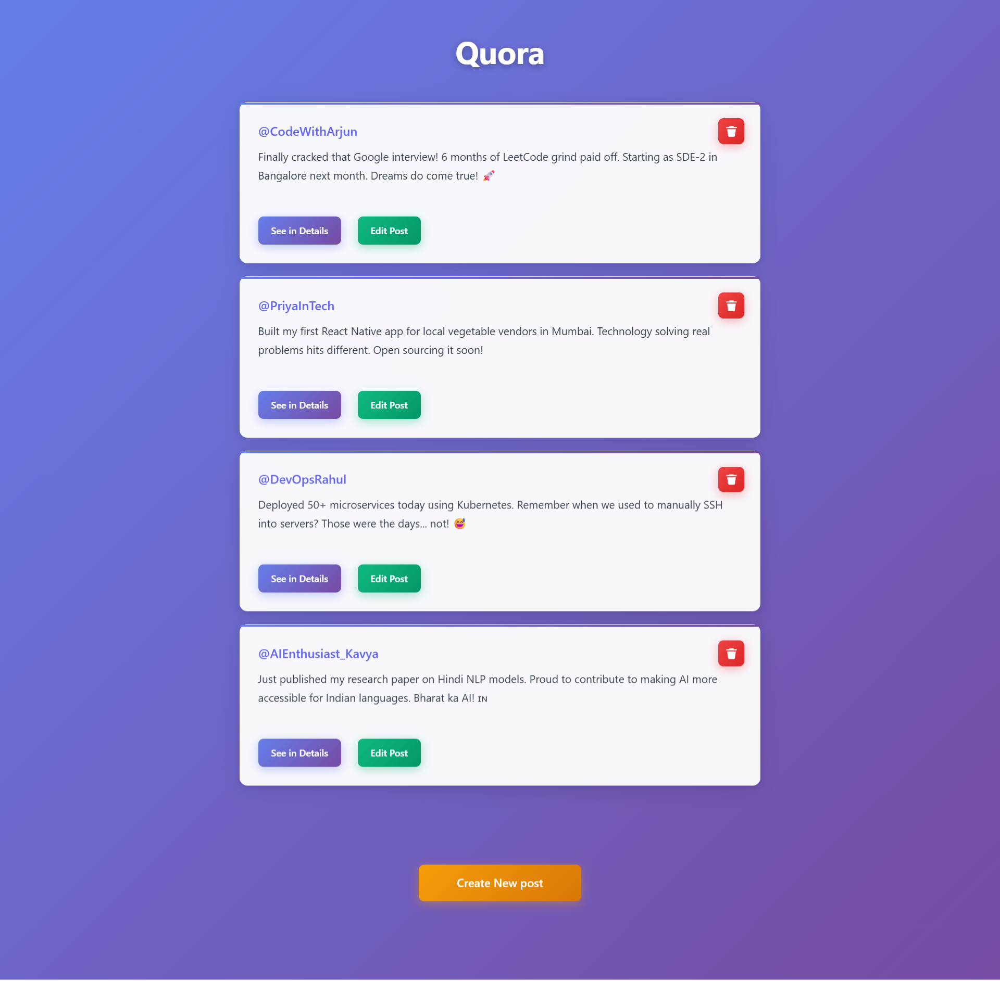
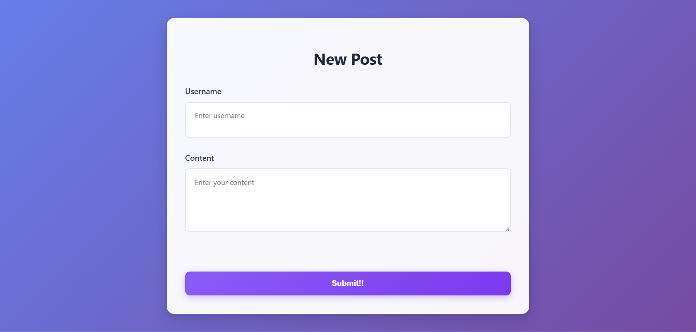
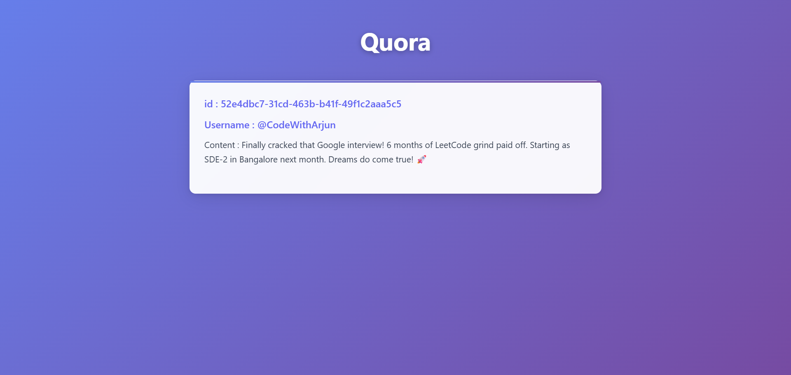
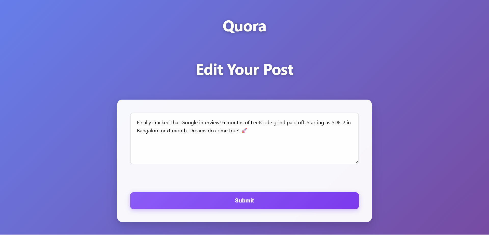

# Quora Clone - Social Media Platform

A full-stack social media application inspired by Quora, built with Node.js, Express.js, and EJS templating engine. Users can create, read, update, and delete posts with a clean and responsive interface.

## 🚀 Features

- **Create Posts**: Add new posts with username and content
- **View Posts**: Browse all posts on the main feed
- **Post Details**: View individual posts in detail
- **Edit Posts**: Update existing post content
- **Delete Posts**: Remove posts with confirmation
- **Responsive Design**: Clean UI that works on all devices
- **RESTful API**: Proper HTTP methods (GET, POST, PATCH, DELETE)

## 🛠️ Tech Stack

- **Backend**: Node.js, Express.js
- **Frontend**: EJS (Embedded JavaScript Templates)
- **Styling**: Custom CSS
- **UUID**: For unique post identification
- **Method Override**: For HTTP verb support in forms

## 📁 Project Structure

```
quora-clone/
├── views/
│   ├── index.ejs          # Main posts feed
│   ├── new.ejs            # Create new post form 
│   ├── show.ejs           # Individual post details 
│   └── edit.ejs           # Edit post form 
├── public/
│   ├── styles.css         # Custom styling
├── screenshots/
│   ├── create-post.png
│   ├── edit-post.png
│   ├── home-feed.png
│   └── post-details.png
├── index.js               # Main server file
├── package.json           # Dependencies
└── README.md             # Project documentation

```

## ⚡ Quick Start

### Prerequisites
- Node.js (v14 or higher)
- npm or yarn

### Installation

1. **Clone the repository**
   ```bash
   git clone https://github.com/yourusername/quora-clone.git
   cd quora-clone
   ```

2. **Install dependencies**
   ```bash
   npm install
   ```

3. **Start the server**
   ```bash
   node index.js
   ```

4. **Open your browser**
   ```
   http://localhost:8080
   ```

## 📋 API Endpoints

| Method | Endpoint | Description |
|--------|----------|-------------|
| GET | `/posts` | View all posts |
| GET | `/posts/new` | Show create post form |
| POST | `/posts` | Create new post |
| GET | `/posts/:id` | View specific post |
| GET | `/posts/:id/edit` | Show edit post form |
| PATCH | `/posts/:id` | Update specific post |
| DELETE | `/posts/:id` | Delete specific post |

## 🎨 Screenshots

### Home Feed


### Create New Post


### Post Details


### Edit Post


## 🔧 Dependencies

```json
{
  "express": "^4.18.2",
  "ejs": "^3.1.9",
  "uuid": "^9.0.0",
  "method-override": "^3.0.0"
}
```

## 🌟 Key Features Implemented

- **CRUD Operations**: Complete Create, Read, Update, Delete functionality
- **RESTful Routes**: Following REST conventions for clean API design
- **Dynamic Templating**: Server-side rendering with EJS
- **Method Override**: Support for PATCH and DELETE in HTML forms
- **Unique IDs**: UUID generation for post identification
- **Responsive Design**: Mobile-friendly interface

## 🚀 Future Enhancements

- [ ] User authentication and profiles
- [ ] Database integration (MongoDB/PostgreSQL)
- [ ] Comment system
- [ ] Like/Upvote functionality
- [ ] Search and filter posts
- [ ] Image upload support
- [ ] Real-time updates with WebSockets
- [ ] Pagination for large datasets

## 🤝 Contributing

1. Fork the repository
2. Create your feature branch (`git checkout -b feature/AmazingFeature`)
3. Commit your changes (`git commit -m 'Add some AmazingFeature'`)
4. Push to the branch (`git push origin feature/AmazingFeature`)
5. Open a Pull Request


## 👨‍💻 Author

**Your Name**
- GitHub: [@tanishkumarsahu](https://github.com/tanishkumarsahu)
- LinkedIn: [Tanish Kumar Sahu](https://www.linkedin.com/in/tanishkumarsahu/)
- Email: tanishsahu9331@gmail.com

## 🙏 Acknowledgments

- Express.js team for the amazing web framework
- EJS community for the templating engine
- Inspiration from Quora's clean interface design

---

⭐ **Star this repository if you found it helpful!**
